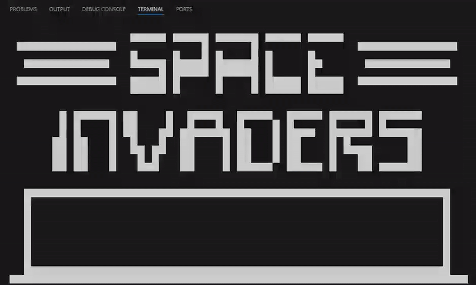

# Chip-8 Emulator

A Python implementation of the CHIP-8 virtual machine with terminal-based display and comprehensive test coverage.



## Overview

CHIP-8 is an interpreted programming language from the 1970s designed for simple games. This emulator recreates the original system with:

- Complete 35-instruction CPU implementation
- 4KB memory with proper memory mapping
- 64×32 monochrome display rendered in terminal
- 16-key hexadecimal input system
- Sound and delay timers

## Games

15PUZZLE, BLINKY, BLITZ, BRIX, CONNECT4, GUESS, HIDDEN, INVADERS, KALEID, MAZE, MERLIN, MISSILE, PONG, PONG2, PUZZLE, SYZYGY, TANK, TETRIS, TICTAC, UFO, VBRIX, VERS, WIPEOFF

## Quick Start

```bash
git clone https://github.com/nikasrmz/chip8-emulator
cd chip8-emulator
pip install keyboard
python main.py <GAME>
```

## Controls

The 16-key CHIP-8 keypad maps to your keyboard like this:

```
CHIP-8 Keypad:        Your Keyboard:
┌───────────────┐    ┌───────────────┐
│ 1 │ 2 │ 3 │ C │    │ 1 │ 2 │ 3 │ 4 │
├───┼───┼───┼───┤    ├───┼───┼───┼───┤
│ 4 │ 5 │ 6 │ D │    │ Q │ W │ E │ R │
├───┼───┼───┼───┤    ├───┼───┼───┼───┤
│ 7 │ 8 │ 9 │ E │    │ A │ S │ D │ F │
├───┼───┼───┼───┤    ├───┼───┼───┼───┤
│ A │ 0 │ B │ F │    │ Z │ X │ C │ V │
└───────────────┘    └───────────────┘
```

## Architecture

```
┌─────────────┐    ┌──────────────┐    ┌─────────────┐
│   Memory    │<-->│     CPU      │<-->│   Display   │
│  (4KB RAM)  │    │ (Fetch/Exec) │    │   (64×32)   │
└─────────────┘    └──────────────┘    └─────────────┘
                           │
                           v
                   ┌──────────────┐
                   │    Input     │
                   │  (16 keys)   │
                   └──────────────┘
```

### Core Components

- **CPU** (`core/cpu.py`) - Instruction processing, registers, timers
- **Memory** (`core/memory.py`) - 4KB RAM, ROM loading, fontset management  
- **Display** (`core/display.py`) - Pixel buffer, sprite rendering, terminal output
- **Input** (`core/input_.py`) - Keyboard mapping and key state tracking

## Technical Specs

| Component | Specification |
|-----------|---------------|
| **Memory** | 4KB (0x000-0xFFF) |
| **Display** | 64×32 monochrome pixels |
| **Registers** | 16×8-bit (V0-VF) |
| **Stack** | 16 levels |
| **Timers** | 60Hz delay/sound timers |
| **CPU Speed** | 1000 instructions/second |

## Memory Map

```
┌──────────────┬─────────────┬──────────────────────┐
│   Address    │    Size     │      Purpose         │
├──────────────┼─────────────┼──────────────────────┤
│ 0x000-0x04F  │   80 bytes  │ Available            │
│ 0x050-0x09F  │   80 bytes  │ Built-in fontset     │
│ 0x0A0-0x1FF  │  352 bytes  │ Available            │
│ 0x200-0xFFF  │ 3584 bytes  │ ROM/Program space    │
└──────────────┴─────────────┴──────────────────────┘
```

## Development

### Running Tests

```bash
# All tests
pytest

# Specific components
pytest tests/test_cpu.py -v
pytest tests/test_memory.py -v
pytest tests/test_display.py -v
pytest tests/test_input.py -v
```

### Project Structure

```
chip8-emulator/
├── core/
│   ├── cpu.py          # CPU implementation
│   ├── memory.py       # Memory management
│   ├── display.py      # Display rendering
│   ├── input_.py       # Input handling
│   ├── emulator.py     # Main emulator loop
│   └── errors.py       # Custom exceptions
├── tests/              # Comprehensive test suite
├── configs.py          # System constants
└── README.md
```

## License

MIT License - see [LICENSE](LICENSE) for details.`
